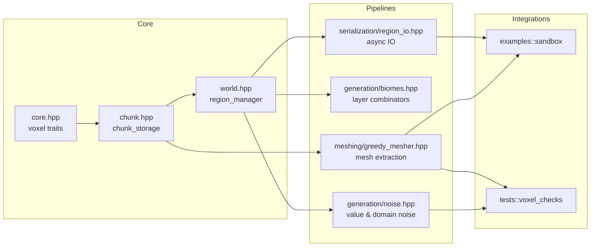
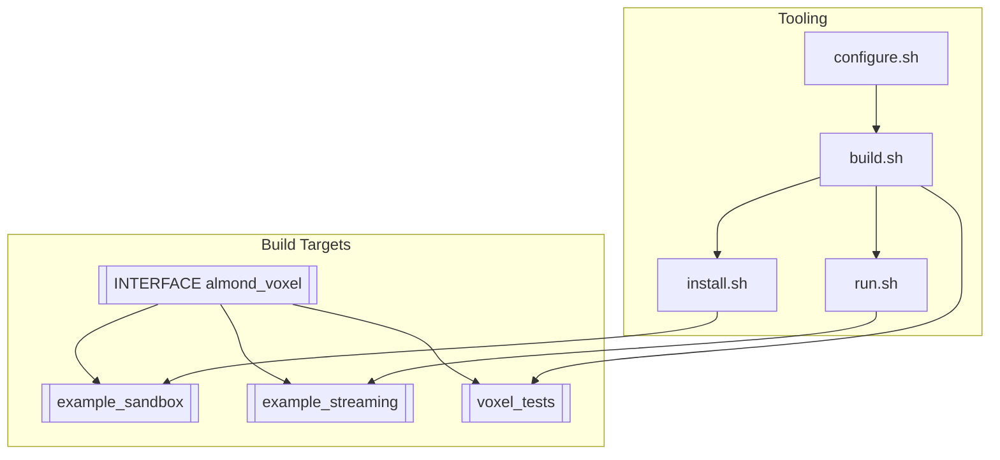

# AlmondVoxel

AlmondVoxel is a header-only C++20 voxel framework that packages spatial data structures, procedural generation pipelines, and rendering-friendly mesh extraction utilities into a single, easily embeddable library. The repository also ships curated examples and regression tests that demonstrate how to stream infinite worlds, serialize regions, and validate greedy meshing outputs. The meshing module now includes both voxel-perfect greedy extraction and a marching cubes surface generator, and the greedy mesher understands neighbour chunk occupancy to eliminate seams at chunk borders.

## Architecture overview





## Feature highlights
- **Header-only distribution** – `almond_voxel` is exported as a pure header target that works with any C++20 toolchain without pre-built binaries.
- **Chunked world management** – deterministic coordinate math with paging, caching, and eviction hooks for infinite terrain.
- **Procedural generation primitives** – layered noise utilities, biome combinators, and density functions optimised for sparse updates.
- **Greedy meshing and mesh decimation** – produces render-ready meshes with configurable material channels and atlas packing.
- **Binary serialization helpers** – compress and stream regions to disk or network transports with background worker helpers.
- **Examples and tests** – sandbox applications and doctest suites that illustrate integration patterns and protect regressions.

## Quick start (downstream consumption)

Add the repository as a Git submodule or fetch the headers into your vendor tree, then wire up the interface target from CMake:

```cmake
# CMakeLists.txt
add_subdirectory(external/AlmondVoxel)
target_link_libraries(my_voxel_app PRIVATE almond_voxel)
```

Include the aggregated header from your source files:

```cpp
#include <almond_voxel/almond_voxel.hpp>

using namespace almond::voxel;

chunk_storage chunks;
region_manager regions{chunks};
region_id origin{0, 0, 0};
regions.ensure_region(origin, [&](auto& chunk) {
    generate::apply_noise(chunk, generate::value_noise{});
});
mesh_buffer mesh = meshing::greedy_mesh(regions.require_chunk(origin));
```

For smooth implicit surfaces, call `meshing::marching_cubes_from_chunk` to extract a marching cubes mesh or provide a custom density sampler to `meshing::marching_cubes`.

If you cannot add the directory as a subproject, copy the `include/almond_voxel` tree into your build and add it to the include path while defining the `ALMOND_VOXEL_HEADER_ONLY` macro.

## Repository layout

| Path | Purpose |
| --- | --- |
| `include/almond_voxel/` | Header-only library organised by domain (core, generation, meshing, serialization). |
| `examples/sandbox/` | Interactive ImGui viewer that visualises chunk streaming and material layering. |
| `examples/streaming_cli/` | Console demo that benchmarks procedural generation pipelines. |
| `tests/` | doctest-powered regression suite for chunk math, greedy and marching-cubes meshing, and serialization codecs. |
| `cmake/` | Toolchain helpers, presets, and exported CMake package configuration. |
| `docs/` | Architecture notes, platform guides, roadmap, and API reference. |

## Using the helper scripts

Even though the core library is header-only, the scripts orchestrate configuration and builds for the bundled examples and tests:

1. **Configure the CMake build tree**
   ```bash
   ./cmake/configure.sh <compiler> <config>
   # e.g. ./cmake/configure.sh clang Release
   ```
   Creates `Bin/<compiler>-<config>` with the `almond_voxel` interface target plus example/test executables.

2. **Build examples and tests**
   ```bash
   ./build.sh <compiler> <config> [target]
   # e.g. ./build.sh gcc Debug example_sandbox
   ```
   Defaults to building all registered targets. Pass a target name (e.g. `voxel_tests`) to narrow the build.

3. **Install headers and samples**
   ```bash
   ./install.sh <compiler> <config>
   ```
   Copies the `include/almond_voxel` tree and compiled examples/tests into `built/<compiler>-<config>` for redistribution.

4. **Run demos or tests**
   ```bash
   ./run.sh <compiler> <config> [example_sandbox|example_streaming|voxel_tests]
   ```
   Launches the requested binary or falls back to the default sandbox demo.

Because the library is header-only, rebuilding after modifying headers is typically instantaneous; only dependent examples or tests need recompilation.

## Examples and tests
- **`example_sandbox`** – visualises chunk residency, noise layers, and meshing overlays.
- **`example_streaming`** – CLI benchmark that simulates region streaming under configurable view distances.
- **`voxel_tests`** – doctest suite covering chunk math, noise determinism, greedy mesh topology, and serialization fidelity.

Use `ctest` inside the build directory or `./run.sh ... voxel_tests` to execute the regression suite.

## Documentation
- [docs/api-overview.md](docs/api-overview.md) summarises each header module and provides integration snippets.
- [docs/roadmap.md](docs/roadmap.md) outlines upcoming voxel engine milestones.
- Platform guides ([docs/linux.md](docs/linux.md), [docs/windows.md](docs/windows.md)) enumerate compiler flags, configuration toggles, and performance tuning tips.

## Contributing
We welcome contributions that expand the voxel toolkit, improve performance, or enhance documentation. Please:

- Open a GitHub issue or discussion describing the feature or fix you plan to work on.
- Link updates to the roadmap and API overview so downstream users can track new modules or changed behaviours.
- Accompany new modules with examples and doctest coverage to guard against regressions.
- Follow the formatting and naming conventions established under `include/almond_voxel`.

## License
AlmondVoxel is released under the MIT License. See [LICENSE](LICENSE) for full terms. Commercial usage is permitted; contributions remain under the same license unless explicitly stated otherwise.
