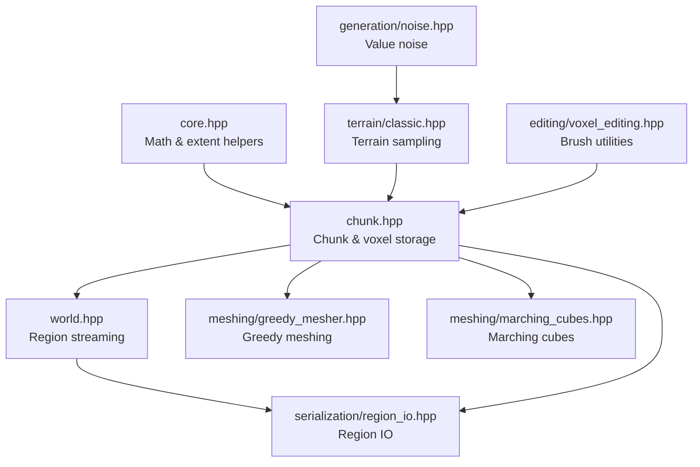
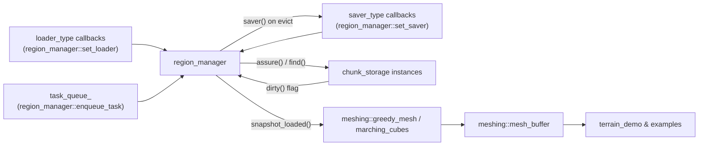
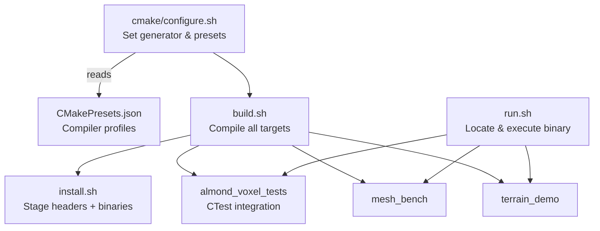

# AlmondVoxel

AlmondVoxel is a header-only C++20 voxel toolkit that bundles chunked storage, region streaming utilities, terrain helpers, and meshing algorithms in a single interface library. The repository ships runnable demos, a benchmark, and a consolidated unit-test executable so the same code paths are exercised on Linux, macOS, and Windows builds.

## Table of contents
- [Overview](#overview)
- [Library modules](#library-modules)
- [Architecture diagrams](#architecture-diagrams)
- [Build and run](#build-and-run)
  - [Configure the build tree](#configure-the-build-tree)
  - [Compile targets](#compile-targets)
  - [Run demos and benchmarks](#run-demos-and-benchmarks)
  - [Execute tests](#execute-tests)
- [Repository layout](#repository-layout)
- [Cross-platform notes](#cross-platform-notes)
- [Documentation map](#documentation-map)
- [Maintenance](#maintenance)

## Overview
- **Header-only interface** – the `almond_voxel` target exports all headers without requiring a separate compile/install step.
- **Chunk & region management** – `chunk_storage` and `region_manager` orchestrate voxel residency with optional compression hooks.
- **Terrain helpers** – `terrain::classic` utilities and editing helpers make it easy to prototype generators.
- **Meshing pipelines** – greedy and marching-cubes meshers emit render-ready buffers from chunk data.
- **Serialization utilities** – `serialization::region_io` provides compression-aware save/load entry points.
- **Integrated validation** – the `almond_voxel_tests` binary covers chunk math, meshing, terrain sampling, serialization, and editing behaviours.

## Library modules
The umbrella header `almond_voxel/almond_voxel.hpp` includes the modules below. Headers can also be included individually for finer-grained builds.

| Header | Highlights | Key types/functions |
| --- | --- | --- |
| `almond_voxel/core.hpp` | Coordinate math, voxel/span helpers, extent utilities. | `voxel_id`, `chunk_extent`, `span3d`, `cubic_extent` |
| `almond_voxel/chunk.hpp` | Chunk storage with lighting/metadata planes and optional compression callbacks. | `chunk_storage`, `chunk_extent`, `voxel_span` |
| `almond_voxel/world.hpp` | Region streaming with pinning, task queues, and eviction. | `region_manager`, `region_key`, `region_snapshot` |
| `almond_voxel/generation/noise.hpp` | Deterministic value noise with palette assignment helpers. | `generation::value_noise`, `palette_builder` |
| `almond_voxel/terrain/classic.hpp` | Ready-made terrain sampling routines layered over noise. | `terrain::classic_heightmap`, `terrain::build_palette` |
| `almond_voxel/editing/voxel_editing.hpp` | Utilities for carving and painting voxel regions. | `editing::apply_sphere`, `editing::apply_box` |
| `almond_voxel/meshing/mesh_types.hpp` | Mesh data containers and attribute helpers. | `meshing::mesh_buffer`, `meshing::vertex` |
| `almond_voxel/meshing/greedy_mesher.hpp` | Greedy meshing for blocky voxel worlds. | `meshing::greedy_mesh` |
| `almond_voxel/meshing/marching_cubes.hpp` | Smooth surface extraction. | `meshing::marching_cubes`, `meshing::marching_cubes_from_chunk` |
| `almond_voxel/serialization/region_io.hpp` | Save/load regions with pluggable compressors. | `serialization::region_writer`, `serialization::region_reader` |
| `tests/test_framework.hpp` | Lightweight assertion macros shared by demos and the consolidated test runner. | `TEST_CASE`, `CHECK`, `run_tests` |

## Architecture diagrams
The diagrams below show how the major headers interact, how runtime systems move data between components, and where the helper
scripts fit into the workflow. Each graph reflects the current code layout in `include/`, the runtime orchestration utilities in
`world.hpp`, and the shell entry points that ship with the repository.

### Module layering


### Runtime data flow


### Build scripts and tooling


## Build and run
All helper scripts live at the repository root. They create per-compiler build folders under `Bin/` and work across Linux (GCC/Clang) and Windows (MSVC + Ninja Multi-Config).

### Configure the build tree
```bash
./cmake/configure.sh <gcc|clang|msvc> <Debug|Release>
# Example: ./cmake/configure.sh clang Release
```
The script auto-detects Ninja on Unix platforms and falls back to Makefiles when necessary. Passing `msvc` selects the Ninja Multi-Config generator so both Debug and Release binaries can coexist.

### Compile targets
```bash
./build.sh <gcc|clang|msvc> <Debug|Release>
# Example: ./build.sh gcc Debug
```
This compiles the interface library plus all enabled demos, tests, and benchmarks for the chosen configuration. CMake options `ALMOND_VOXEL_BUILD_EXAMPLES`, `ALMOND_VOXEL_BUILD_TESTS`, and `ALMOND_VOXEL_BUILD_BENCHMARKS` default to `ON`; toggle them during configuration if you need a slimmer build.

To install headers and built executables into `built/bin/<Compiler>-<Config>/`:
```bash
./install.sh <gcc|clang|msvc> <Debug|Release>
```

### Single-header distribution
Generate the amalgamated header during configuration to install a consolidated `almond_voxel_single.hpp` alongside the
regular modular headers:
```bash
cmake -S . -B build -DALMOND_VOXEL_BUILD_AMALGAMATED=ON
```
The configure step wires a build target that runs `tools/generate_amalgamated_header.py`, keeps the result in the build
tree, and installs it to `<prefix>/include/almond_voxel_single.hpp`. When the option is enabled the exported
`almond_voxel` interface defines `ALMOND_VOXEL_USE_AMALGAMATED_HEADER`, so existing `#include <almond_voxel/almond_voxel.hpp>`
calls pick up the single header automatically. Projects that prefer to use the amalgamation directly can include it
explicitly:
```cpp
#include <almond_voxel_single.hpp>
```

### Run demos and benchmarks
The repository provides runnable targets that exercise different parts of the library:

| Target | Description |
| --- | --- |
| `terrain_demo` | SDL3-powered viewport that streams regions, applies editing brushes, and renders naive/greedy cubes or marching-cubes surfaces. |
| `classic_heightfield_example` | Console sample that generates a simple height map and prints summary metrics. |
| `cubic_naive_mesher_example` | Emits all visible cube faces without merging to showcase the baseline meshing path. |
| `greedy_mesher_example` | Demonstrates greedy mesh extraction for a procedurally generated chunk. |
| `marching_cubes_example` | Extracts a smooth mesh from noise-populated data. |
| `mesh_bench` | Command-line benchmark measuring greedy meshing throughput. |

Use `run.sh` to search common build directories and launch a binary:
```bash
./run.sh terrain_demo
./run.sh cubic_naive_mesher_example
./run.sh greedy_mesher_example
```
Pass additional arguments after `--` to configure the SDL demo, for example `./run.sh terrain_demo -- --mesher=naive` to start with the naive cubic mesher.
On Windows PowerShell, invoke the script through `bash` (included with Git for Windows):
```powershell
bash ./run.sh terrain_demo
```

### Execute tests
The unit-test binary is built alongside the demos:
```bash
./run.sh almond_voxel_tests
```
Or run the tests via CTest from the build directory if you prefer native tooling:
```bash
cd Bin/GCC-Debug  # adjust for your compiler/configuration
ctest --output-on-failure
```

## Repository layout
| Path | Purpose |
| --- | --- |
| `include/almond_voxel/` | Header-only library organised by domain (core, world, generation, terrain, editing, meshing, serialization). |
| `examples/` | Sample applications listed in the table above. |
| `tests/` | Doctest-based unit tests compiled into `almond_voxel_tests`. |
| `benchmarks/` | Performance harnesses such as `mesh_bench`. |
| `cmake/` | Configuration scripts, including `configure.sh`. |
| `docs/` | Platform guides, API overview, roadmap, and changelog. |
| `readme/` | Visual Studio helper documentation for cross-platform projects. |

## Cross-platform notes
- **Linux & macOS** – install a C++20 compiler (GCC 12+/Clang 15+), CMake 3.23+, Ninja (optional), and SDL3 development headers for the terrain demo (`libsdl3-dev` on Debian/Ubuntu, `brew install sdl3` on macOS).
- **Windows** – use Visual Studio 2022 or the MSVC Build Tools with CMake/Ninja. SDL3 binaries can be supplied via [vcpkg](https://github.com/microsoft/vcpkg) (`vcpkg install sdl3`) or the official development packages. Invoke the scripts from *x64 Native Tools* or *Developer PowerShell* so the compiler is on `PATH`.
- **Headless environments** – build `classic_heightfield_example`, `cubic_naive_mesher_example`, `greedy_mesher_example`, `marching_cubes_example`, `mesh_bench`, and `almond_voxel_tests`. The SDL3-based `terrain_demo` can be skipped by setting `-DALMOND_VOXEL_BUILD_EXAMPLES=OFF` or by disabling SDL3 discovery.

## Documentation map
- [docs/api-overview.md](docs/api-overview.md) – module-by-module reference with example snippets.
- [docs/linux.md](docs/linux.md) – Linux/macOS setup, build, and troubleshooting guide.
- [docs/windows.md](docs/windows.md) – Windows-specific setup and workflow notes.
- [docs/CHANGELOG.md](docs/CHANGELOG.md) – release history and documentation updates.
- [docs/roadmap.md](docs/roadmap.md) – internal milestones for upcoming work.
- [docs/tools_list.txt](docs/tools_list.txt) – snapshot of the toolchain used to maintain the project.

## Maintenance
AlmondVoxel is maintained privately and published for reference. External contributions, pull requests, and unsolicited patches are not being accepted.
