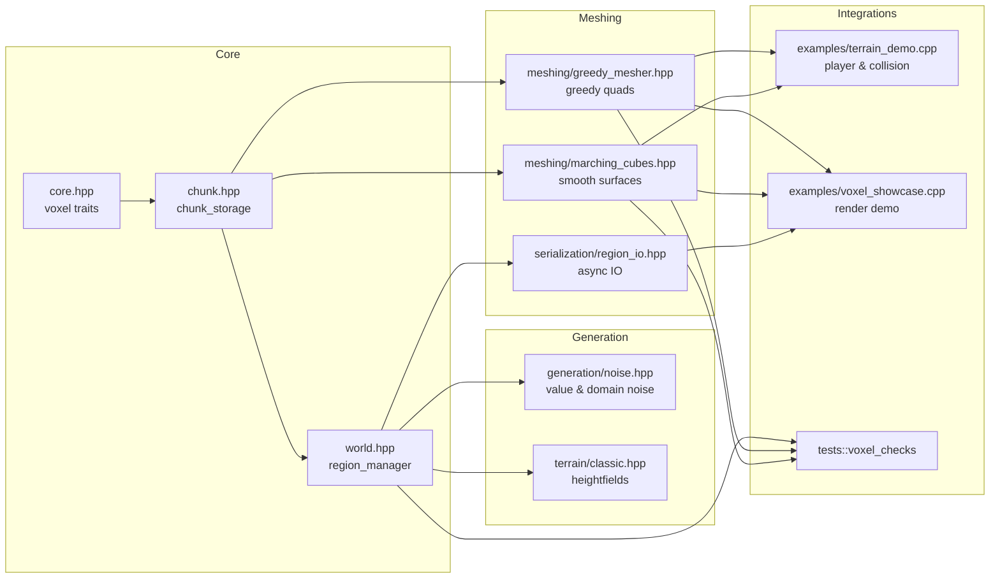
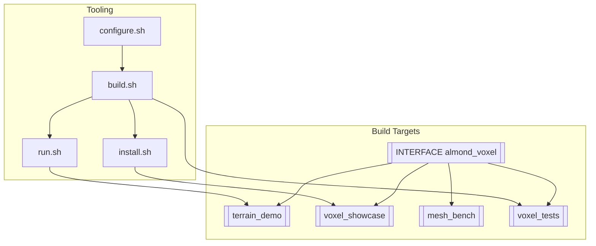

# AlmondVoxel

AlmondVoxel is a header-only C++20 voxel framework that packages spatial data structures, procedural generation pipelines, and rendering-friendly mesh extraction utilities into a single, easily embeddable library. The repository also ships curated examples and regression tests that demonstrate how to stream infinite worlds, serialize regions, and validate greedy/marching-cubes meshes.

## Table of contents
- [Overview](#overview)
- [Key capabilities](#key-capabilities)
- [Getting started](#getting-started)
  - [Add the library to another project](#add-the-library-to-another-project)
  - [Local build and scripts](#local-build-and-scripts)
- [Repository layout](#repository-layout)
- [Tooling scripts](#tooling-scripts)
- [Documentation map](#documentation-map)
- [Contributing](#contributing)
- [License](#license)

## Overview
- **Header-only distribution** – `almond_voxel` is exported as a pure header target that works with any C++20 toolchain without pre-built binaries.
- **Chunked world management** – deterministic coordinate math with paging, caching, and eviction hooks for infinite terrain.
- **Procedural generation primitives** – layered noise utilities, biome combinators, and density functions optimised for sparse updates.
- **Greedy meshing and marching cubes** – produces render-ready meshes with configurable material channels and atlas packing.
- **Binary serialization helpers** – compress and stream regions to disk or network transports with background worker helpers.
- **Examples and tests** – sandbox applications and doctest suites that illustrate integration patterns and protect regressions.

Two Mermaid diagrams summarise the runtime architecture and build artefacts:





## Key capabilities
The library is split into focused modules that can be composed together or consumed individually:

| Domain | Highlights |
| --- | --- |
| **Core math & storage** | `core.hpp`, `chunk.hpp`, and `world.hpp` define the voxel coordinate types, chunk storage, and region manager abstractions. |
| **Generation** | `generation/noise.hpp` and `generation/biomes.hpp` provide deterministic value/domain noise stacks and biome combinators. |
| **Meshing** | `meshing/greedy_mesher.hpp` implements greedy meshing and exposes marching cubes helpers for smooth surfaces. |
| **Serialization** | `serialization/region_io.hpp` streams regions using raw, LZ4, or Zstd compression and async IO helpers. |
| **Testing** | `testing/doctest.hpp` bundles doctest defaults and assertion helpers for downstream verification. |

## Getting started
### Add the library to another project
AlmondVoxel is easiest to consume via CMake:

```cmake
add_subdirectory(external/AlmondVoxel)
target_link_libraries(my_voxel_app PRIVATE almond_voxel)
```

Include the aggregated header from your source files:

```cpp
#include <almond_voxel/almond_voxel.hpp>

using namespace almond::voxel;

chunk_storage chunks;
region_manager regions{chunks};
region_id origin{0, 0, 0};
regions.ensure_region(origin, [&](auto& chunk) {
    generate::apply_noise(chunk, generate::value_noise{});
});
mesh_buffer mesh = meshing::greedy_mesh(regions.require_chunk(origin));
```

For smooth implicit surfaces, call `meshing::marching_cubes_from_chunk` to extract a marching cubes mesh or provide a custom density sampler to `meshing::marching_cubes`.

If you cannot add the directory as a subproject, copy the `include/almond_voxel` tree into your build and add it to the include path while defining the `ALMOND_VOXEL_HEADER_ONLY` macro.

### Local build and scripts
Even though the core library is header-only, the scripts orchestrate configuration and builds for the bundled examples and tests:

```bash
./cmake/configure.sh <compiler> <config>
# e.g. ./cmake/configure.sh clang Release

./build.sh <compiler> <config> [target]
# e.g. ./build.sh gcc Debug example_sandbox

./install.sh <compiler> <config>

./run.sh <compiler> <config> [example_sandbox|example_streaming|voxel_tests]
```

Because the library is header-only, rebuilding after modifying headers is typically instantaneous; only dependent examples or tests need recompilation.

## Repository layout
| Path | Purpose |
| --- | --- |
| `include/almond_voxel/` | Header-only library organised by domain (core, generation, meshing, serialization). |
| `examples/sandbox/` | Interactive ImGui viewer that visualises chunk streaming and material layering. |
| `examples/streaming_cli/` | Console demo that benchmarks procedural generation pipelines. |
| `tests/` | doctest-powered regression suite for chunk math, greedy and marching-cubes meshing, and serialization codecs. |
| `cmake/` | Toolchain helpers, presets, and exported CMake package configuration. |
| `docs/` | Architecture notes, platform guides, roadmap, and API reference. |

## Tooling scripts
1. **Configure the CMake build tree** – creates `Bin/<compiler>-<config>` with the `almond_voxel` interface target plus example/test executables.
2. **Build examples and tests** – defaults to building all registered targets. Pass a target name (e.g. `voxel_tests`) to narrow the build.
3. **Install headers and samples** – copies headers and compiled artefacts into `built/<compiler>-<config>` for redistribution.
4. **Run demos or tests** – launches the requested binary or falls back to the default sandbox demo.

## Documentation map
- [docs/api-overview.md](docs/api-overview.md) summarises each header module and provides integration snippets.
- [docs/roadmap.md](docs/roadmap.md) outlines upcoming voxel engine milestones.
- Platform guides ([docs/linux.md](docs/linux.md), [docs/windows.md](docs/windows.md)) enumerate compiler flags, configuration toggles, and performance tuning tips.
- [docs/CHANGELOG.md](docs/CHANGELOG.md) tracks the full history of template changes.

## Contributing
We welcome contributions that expand the voxel toolkit, improve performance, or enhance documentation. Please:

- Open a GitHub issue or discussion describing the feature or fix you plan to work on.
- Link updates to the roadmap and API overview so downstream users can track new modules or changed behaviours.
- Accompany new modules with examples and doctest coverage to guard against regressions.
- Follow the formatting and naming conventions established under `include/almond_voxel`.

## License
AlmondVoxel is released under the MIT License. See [LICENSE](LICENSE) for full terms. Commercial usage is permitted; contributions remain under the same license unless explicitly stated otherwise.
